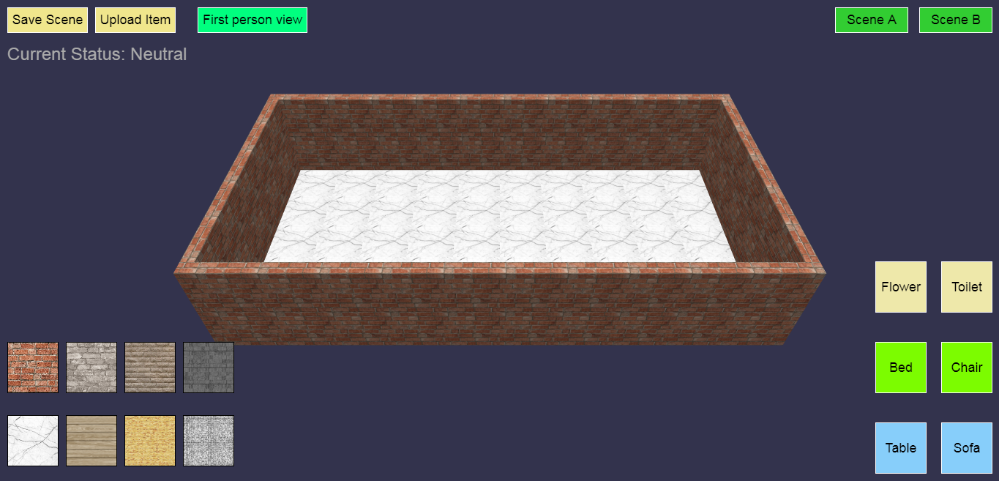

# RoomFurnishing

This is a JavaScript 3D Graphics Application that was created for my University project. It is designed to help users create and decorate their room of their dreams.



<i>Created by: Ryan Anggada Kho, Georgius Kurli and Nicolas Lee</i>

## How to run this program

Download XAMPP and then, place all of this files downloaded in its htdocs file and run via localhost.

## File Information

main.html: Main program

sceneloader.html: View saved scene

## Controls

```
Z for x, y or z movement.

X for rotation on x,y or z.

C for scaling and dragging movement.

V for clone object.

B for neutral state.

N for delete state.

Arrow keys or WASD for movement in first person.
```

## References and Credit

Wall Tile 1: http://wallperio.com/download-wp/595488629.html

Wall Tile 2: http://wallperio.com/download-wp/595488945.html

Floor Tile 1: https://pixabay.com/illustrations/white-pattern-tile-abstract-floor-2398955/

Floor Tile 2: https://www.freepik.com/free-vector/wood-board-texture_841463.htm
 
Furniture Models

Bed: https://clara.io/view/f8ac4d03-76cd-4ed9-8e07-0aa4af9dc68e

Chair: https://clara.io/view/24a65aaf-ebca-4f56-9e8f-ce26a6ef8aac

Sofa: https://clara.io/view/c63a181c-2dde-4f5e-bfa2-b15b41015f94#

Table: https://clara.io/view/b2f976c2-bbde-456a-9751-724438f35627 

Flower Pot: https://clara.io/view/ca186717-56b3-4561-967a-79eaf66f2bf6# 

Toilet: https://clara.io/view/45cf90e5-656f-4bac-b999-8a7af6f70b2c#
